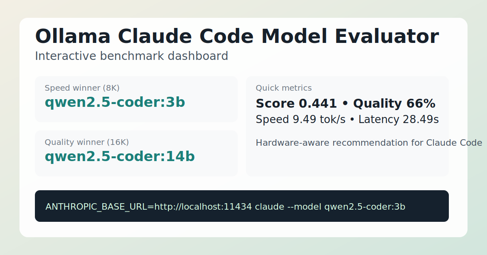

# Ollama Claude Code Model Evaluator

[](https://github.com/davidop/ollama-claude-code-model-evaluator/actions/workflows/validate.yml)
[](LICENSE)
[](https://www.python.org/downloads/)
[](https://ollama.com/)
[](https://docs.anthropic.com/en/docs/claude-code)

Idioma:

- Español: [README.md](README.md)
- English: [README.en.md](README.en.md)

**Evalúa tus modelos locales de Ollama y encuentra el mejor para tareas de desarrollo y Claude Code — en minutos, en tu propio hardware.**

> Si este proyecto te ayuda a elegir el modelo local adecuado para tu máquina, considera darle una ⭐ estrella y compartir tus resultados de benchmark.
>
> Puedes compartir los tuyos con la plantilla [Benchmark result](.github/ISSUE_TEMPLATE/benchmark_result.md).

Enlaces rapidos:

- Dashboard interactivo: [dashboard.html](dashboard.html)
- Benchmark estandar (JSON): [results/benchmark-standard.json](results/benchmark-standard.json)
- Benchmark con contexto 16384 + 14b (JSON): [results/benchmark-ctx16384-plus14b.json](results/benchmark-ctx16384-plus14b.json)
- Changelog: [CHANGELOG.md](CHANGELOG.md)

## Dashboard preview



## Para quien es esto

- **Desarrolladores que usan LLMs locales** y quieren saber qué modelo es más rápido y preciso para tareas de código en su hardware específico.
- **Personas que prueban Claude Code con modelos locales** y necesitan una forma reproducible de elegir el modelo correcto sin prueba y error.
- **Equipos que comparan rendimiento de modelos entre máquinas** — comparte tus resultados JSON y que otros los reproduzcan.
- **AI engineers que hacen benchmark de modelos de código** que quieren una herramienta CLI ligera, sin dependencias, ejecutable en cualquier lugar.

## Por que importa

- **Menor costo:** evalua modelos locales antes de gastar en APIs cloud.
- **Mayor privacidad:** codigo y prompts se quedan en tu equipo.
- **Mejor ajuste real:** decides segun tu hardware, no solo por rankings genericos.

El benchmark mide:

- Velocidad media en tokens/segundo.
- Latencia media.
- Calidad aproximada mediante tests de código.
- Modelo ganador recomendado para usar con Claude Code.

> El script no usa dependencias externas de Python. Funciona con la librería estándar.

## Quick start

> **Requisitos:** Python 3.10+, [Ollama](https://ollama.com/) instalado.

**1. Inicia Ollama:**

```bash
ollama serve
```

**2. Ejecuta el benchmark (Linux/macOS):**

```bash
python eval_ollama_models.py --pull --num-ctx 8192 \
  --output ./results/benchmark-standard.json \
  --models qwen2.5-coder:3b qwen2.5-coder:7b deepseek-coder:6.7b
```

**3. Usa el modelo ganador con Claude Code:**

El script imprime el comando listo para usar al final:

```bash
ANTHROPIC_AUTH_TOKEN=ollama ANTHROPIC_API_KEY="" ANTHROPIC_BASE_URL=http://localhost:11434 claude --model qwen2.5-coder:3b
```

Atajos con scripts incluidos:

- Windows: `scripts/run-basic.ps1`
- Linux/macOS: `scripts/run-basic.sh`

Al usar esos atajos, ahora tambien se genera automaticamente:

- `results/dashboard-data.js` con resultados + hardware detectado del PC.
- snapshots historicos en `results/history/` con timestamp por ejecucion.

Luego solo abre `dashboard.html` para ver el dashboard actualizado sin editar HTML manualmente.

## Ejemplo de salida

Tras ejecutar el benchmark obtienes una tabla como esta:

```
Rank  Modelo                 Score   Quality  Tokens/s  Latencia(s)  Passed
1     qwen2.5-coder:3b       0.428   0.530    9.49      28.49        1/4
2     qwen2.5-coder:7b       0.406   0.573    3.86      53.15        1/4
3     deepseek-coder:6.7b    0.308   0.430    3.31      117.90       1/4

Ganador: qwen2.5-coder:3b

Para usar con Claude Code:
  ANTHROPIC_AUTH_TOKEN=ollama ANTHROPIC_API_KEY="" ANTHROPIC_BASE_URL=http://localhost:11434 claude --model qwen2.5-coder:3b
```

Los resultados completos se guardan en JSON para compartir y reproducir.

## Resultados recientes (este PC)

Los siguientes resultados se generaron en este repositorio con los comandos estandar documentados.

### Benchmark estandar (num_ctx=8192)

| Rank | Modelo | Score | Quality | Tokens/s | Latencia (s) | Passed |
| ---- | ------ | ----- | ------- | -------- | ------------ | ------ |
| 1 | qwen2.5-coder:3b | 0.428 | 0.530 | 9.49 | 28.49 | 1/4 |
| 2 | qwen2.5-coder:7b | 0.406 | 0.573 | 3.86 | 53.15 | 1/4 |
| 3 | deepseek-coder:6.7b | 0.308 | 0.430 | 3.31 | 117.90 | 1/4 |

Ganador estandar para este equipo: **qwen2.5-coder:3b**.

### Benchmark calidad (num_ctx=16384, incluye 14b)

| Rank | Modelo | Score | Quality | Tokens/s | Latencia (s) | Passed |
| ---- | ------ | ----- | ------- | -------- | ------------ | ------ |
| 1 | qwen2.5-coder:14b | 0.441 | 0.660 | 1.41 | 135.42 | 2/4 |
| 2 | qwen2.5-coder:3b | 0.379 | 0.480 | 7.65 | 41.13 | 1/4 |
| 3 | qwen2.5-coder:7b | 0.371 | 0.522 | 3.55 | 94.89 | 1/4 |
| 4 | deepseek-coder:6.7b | 0.307 | 0.430 | 3.16 | 141.75 | 1/4 |

Ganador por calidad en este equipo: **qwen2.5-coder:14b**.

Lectura rapida:

- Si priorizas velocidad y latencia: usa `qwen2.5-coder:3b`.
- Si priorizas calidad final para Claude Code: usa `qwen2.5-coder:14b`.

## Uso básico

Evaluar modelos ya instalados:

```bash
python eval_ollama_models.py --models qwen2.5-coder:7b deepseek-coder:6.7b codellama:7b
```

Descargar modelos faltantes y evaluarlos:

```bash
python eval_ollama_models.py --pull --models qwen2.5-coder:3b qwen2.5-coder:7b
```

Usar más contexto:

```bash
python eval_ollama_models.py --pull --num-ctx 16384 --models qwen2.5-coder:7b qwen2.5-coder:14b
```

Guardar resultados en otro fichero:

```bash
python eval_ollama_models.py --output results.json --models qwen2.5-coder:7b
```

## Recomendaciones por hardware

| Hardware aproximado | Modelos a probar                          |
| ------------------- | ----------------------------------------- |
| CPU / 16 GB RAM     | `qwen2.5-coder:3b`, `qwen2.5-coder:7b`    |
| NVIDIA 8 GB VRAM    | `qwen2.5-coder:7b`, `deepseek-coder:6.7b` |
| NVIDIA 12 GB VRAM   | `qwen2.5-coder:7b`, `qwen2.5-coder:14b`   |
| NVIDIA 16 GB VRAM   | `qwen2.5-coder:14b`                       |
| NVIDIA 24 GB VRAM   | `qwen2.5-coder:32b`                       |

## DevContainer (recomendado si tienes problemas con Python en Windows)

Este repo incluye `/.devcontainer/devcontainer.json` para abrirlo con Python ya listo dentro de un contenedor.

1. Instala Docker Desktop y la extension `Dev Containers` en VS Code.
2. Con Ollama activo en tu host (`ollama serve`), abre el comando:
   - `Dev Containers: Reopen in Container`
3. Dentro del contenedor, ejecuta el benchmark normalmente:

```bash
python eval_ollama_models.py --num-ctx 8192 --output ./results/benchmark-standard.json --models qwen2.5-coder:3b qwen2.5-coder:7b deepseek-coder:6.7b
```

Nota: el DevContainer usa `OLLAMA_BASE_URL=http://host.docker.internal:11434` para conectarse al Ollama que corre en tu maquina host.

## Ejecutar desde el móvil contra el PC

El modelo corre en el PC. El móvil solo ejecuta el script y llama a la API de Ollama por red local.

### En el PC

Linux/macOS:

```bash
OLLAMA_HOST=0.0.0.0:11434 ollama serve
```

Windows PowerShell:

```powershell
$env:OLLAMA_HOST="0.0.0.0:11434"
ollama serve
```

Obtén la IP local del PC.

Windows:

```powershell
ipconfig
```

Linux/macOS:

```bash
ip addr
```

### En Android con Termux

```bash
pkg update
pkg install python
python eval_ollama_models.py --base-url http://192.168.1.50:11434 --models qwen2.5-coder:7b deepseek-coder:6.7b codellama:7b
```

Cambia `192.168.1.50` por la IP real de tu PC.

## Usar el modelo ganador con Claude Code

El script imprime un comando similar a este:

```bash
ANTHROPIC_AUTH_TOKEN=ollama ANTHROPIC_API_KEY="" ANTHROPIC_BASE_URL=http://localhost:11434 claude --model qwen2.5-coder:7b
```

En Linux/macOS puedes exportarlo así:

```bash
export ANTHROPIC_AUTH_TOKEN=ollama
export ANTHROPIC_API_KEY=""
export ANTHROPIC_BASE_URL=http://localhost:11434
claude --model qwen2.5-coder:7b
```

En Windows PowerShell:

```powershell
$env:ANTHROPIC_AUTH_TOKEN="ollama"
$env:ANTHROPIC_API_KEY=""
$env:ANTHROPIC_BASE_URL="http://localhost:11434"
claude --model qwen2.5-coder:7b
```

## Nota sobre la puntuación

La puntuación no pretende sustituir a un benchmark académico. Está pensada para una decisión práctica: qué modelo local es más útil para tareas de código en tu propia máquina.

La fórmula actual pondera:

- 65% calidad aproximada.
- 35% velocidad, normalizada contra 40 tokens/s.

Puedes modificar los tests en la constante `TESTS` del script.

## Checklist de publicación (v0.1.0)

Pasos para publicar la primera release:

1. Ejecuta el benchmark estándar y confirma que existe `results/benchmark-standard.json`.
2. Actualiza la tabla "Resultados recientes" en ambos README.
3. Ejecuta `bash scripts/release-check.sh` y confirma que todos los checks pasan.
4. Verifica que CI pase en GitHub Actions (`Validate`).
5. Actualiza [CHANGELOG.md](CHANGELOG.md): mueve los items de `[Unreleased]` bajo `[0.1.0]` con la fecha de hoy.
6. Crea el tag `v0.1.0` y haz push.
7. Crea un GitHub Release desde ese tag usando [docs/release/v0.1.0-release-notes.md](docs/release/v0.1.0-release-notes.md) como cuerpo.
8. Adjunta `results/benchmark-standard.json` y `results/benchmark-ctx16384-plus14b.json` a la release.
9. Abre al menos un issue de roadmap para mostrar dirección del proyecto.

Activos listos para publicar:

- Notas de release v0.1.0: [docs/release/v0.1.0-release-notes.md](docs/release/v0.1.0-release-notes.md)
- Launch pack para redes: [docs/release/launch-pack.md](docs/release/launch-pack.md)
- Checklist automatizado de release: [scripts/release-check.sh](scripts/release-check.sh)

## Public launch checklist

Una vez publicada la release técnica:

- [ ] Configura la descripción del repositorio en GitHub (About → Description).
- [ ] Configura el homepage del repositorio en GitHub (About → Website).
- [ ] Añade los topics recomendados en GitHub (About → Topics).
- [ ] Convierte `v0.1.0` de pre-release a stable release cuando esté listo.
- [ ] Abre al menos un issue de roadmap para mostrar la dirección del proyecto.
- [ ] Añade un screenshot del dashboard en el README.
- [ ] Publica un post en LinkedIn con una petición clara de feedback y estrellas.

> v0.1.0 can be promoted from pre-release to stable once metadata, roadmap issues and dashboard screenshot are ready.

## Roadmap

- [ ] Soporte para LM Studio / proveedor compatible con OpenAI
- [ ] Soporte para vLLM
- [ ] Tests de benchmark más ricos (.NET, Azure, Python, frontend)
- [ ] Recomendaciones de modelos según hardware detectado
- [ ] Mejoras al dashboard de benchmark (filtros, exportación)
- [ ] Validación por GitHub Actions de resultados de benchmark
- [ ] Exportación de perfil de hardware

Consulta los docs de roadmap detallados en [docs/release/](docs/release/).

### Suggested initial roadmap issues

Issues recomendados para abrir como primeras tareas del roadmap:

- **Add LM Studio / OpenAI-compatible provider support** — amplía el evaluador más allá de Ollama a cualquier proveedor compatible con la API de OpenAI.
- **Add vLLM provider support** — soporte para inferencia de alto rendimiento con vLLM para modelos más grandes.
- **Improve benchmark scoring beyond keyword matching** — métricas de calidad más precisas que la detección actual por keywords.
- **Add hardware-aware model recommendations** — sugiere modelos automáticamente según la GPU y RAM detectadas.

## Contribuir

Las contribuciones son bienvenidas: nuevos tests de benchmark, resultados de hardware, bug reports, soporte para nuevos proveedores.

Consulta [CONTRIBUTING.md](CONTRIBUTING.md) para instrucciones sobre:

- Proponer nuevos modelos
- Añadir tests de benchmark
- Compartir resultados de hardware
- Abrir bugs o mejoras

Ideas para buenos primeros issues:

- Add OpenAI-compatible provider support
- Add LM Studio support
- Add vLLM support
- Add GitHub Actions for linting
- Add richer benchmark tasks for .NET, Azure, Python and frontend code
- Add hardware profile export

## GitHub repository metadata

Los siguientes valores deben configurarse manualmente en GitHub (no forman parte del código fuente):

**Description:**
> Benchmark local Ollama models for coding tasks and Claude Code. Compare quality, speed and latency on your own hardware.

**Website / homepage:**
> https://github.com/davidop/ollama-claude-code-model-evaluator

**Topics:**
`ollama` `claude-code` `local-ai` `llm` `benchmark` `coding-assistant` `qwen` `deepseek` `python` `developer-tools`

Para configurarlos, ve a tu repositorio en GitHub → haz clic en el ⚙️ icono de engranaje junto a "About" en el panel derecho.
